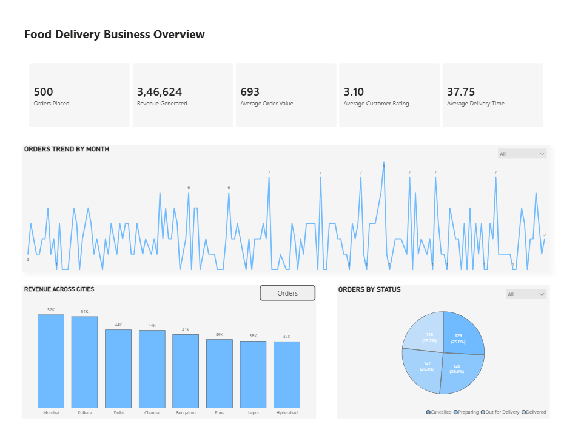
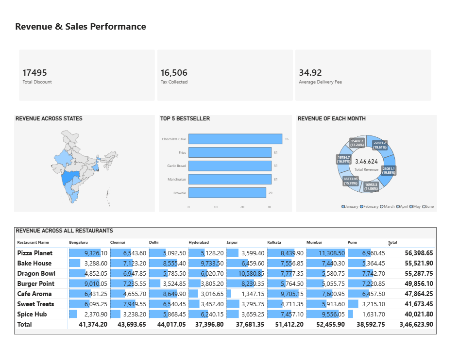
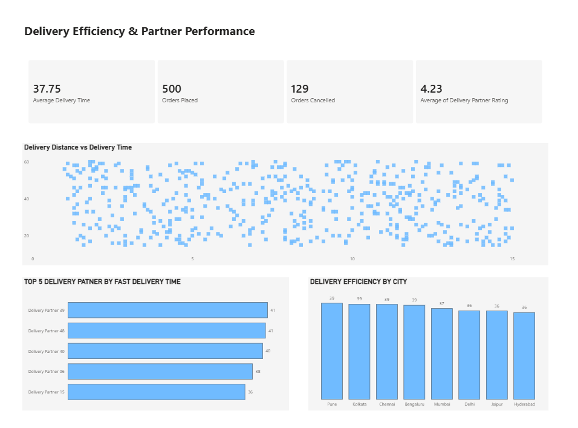
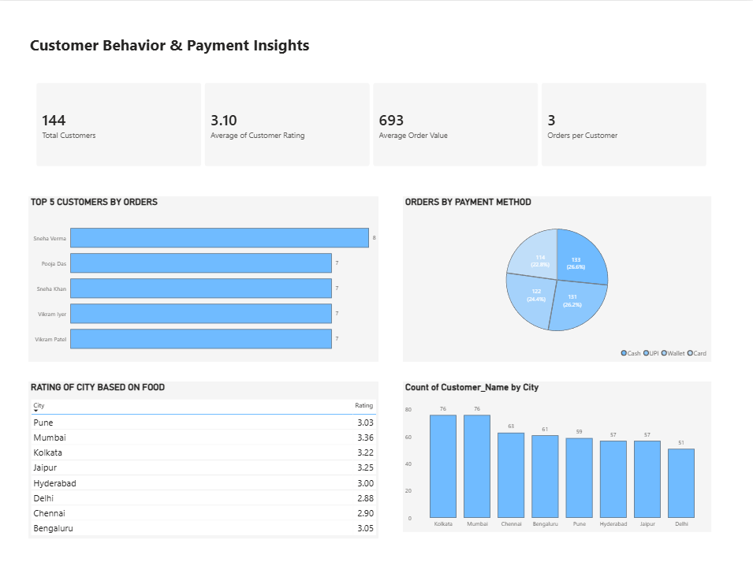

# FOOD DELIVERY PERFORMANCE ANALYTICS

An interactive Power BI dashboard designed to analyze food delivery business performance across sales, orders, delivery operations, customers, and payment behavior.

## Project Overview

This project transforms food delivery order data into an interactive business intelligence dashboard using Microsoft Power BI.

The dashboard provides a consolidated view of:

- Order performance
- Revenue and sales
- Delivery efficiency
- Delivery partner performance
- Customer behavior
- Payment methods
- City and restaurant performance

The objective is to transform raw food delivery data into meaningful insights that can support business and operational decision-making.

---
## Dashboard Preview

### Executive Overview



### Revenue & Sales



### Delivery Performance



### Customer Insights



## Business Questions

This project focuses on answering key business questions.

### 1. How is the food delivery business performing?

- How many orders were placed?
- How much revenue was generated?
- What is the Average Order Value?
- What is the average customer rating?
- What is the average delivery time?

### 2. How are sales and revenue performing?

- Which states generate the most revenue?
- Which restaurants generate the highest revenue?
- Which food items are the best sellers?
- How does revenue vary across months?

### 3. Are deliveries being completed efficiently?

- What is the average delivery time?
- How does delivery distance relate to delivery time?
- Which delivery partners perform the most fast deliveries?
- How does delivery efficiency vary across cities?
- How many orders were cancelled?

### 4. What does customer behavior look like?

- How many customers are there?
- Which customers place the most orders?
- What is the average order value?
- How many orders does each customer place?
- Which cities have the highest number of customers?
- Which payment methods are most commonly used?

---

## Dashboard Pages

### 01 — Executive Overview

Provides a high-level view of overall food delivery business performance.

#### Key Metrics

- Orders Placed
- Revenue Generated
- Average Order Value
- Average Customer Rating
- Average Delivery Time

#### Visual Analysis

- Orders Trend by Month
- Orders Across Cities
- Orders by Status

---

### 02 — Revenue & Sales

Focuses on revenue generation and sales performance.

#### Key Metrics

- Total Discount
- Tax Collected
- Average Delivery Fee

#### Visual Analysis

- Revenue Across States
- Top 5 Best Sellers
- Revenue by Month
- Revenue Across Restaurants

---

### 03 — Delivery Performance

Analyzes delivery efficiency and delivery partner performance.

#### Key Metrics

- Average Delivery Time
- Orders Placed
- Orders Cancelled
- Average Delivery Partner Rating

#### Visual Analysis

- Delivery Distance vs Delivery Time
- Top Delivery Partners by Fast Delivery Time
- Delivery Efficiency by City

---

### 04 — Customer Insights

Analyzes customer behavior, ratings, and payment preferences.

#### Key Metrics

- Total Customers
- Average Customer Rating
- Average Order Value
- Orders per Customer

#### Visual Analysis

- Top 5 Customers by Orders
- Orders by Payment Method
- City-wise Customer Rating
- Customer Count by City

---

## Tools and Technologies

- Microsoft Power BI
- Power Query
- DAX
- Data Modeling
- Data Visualization

---

## Key Metrics

| Metric | Value |
|---|---:|
| Orders Placed | 500 |
| Revenue Generated | ₹3,46,624 |
| Average Order Value | ₹693 |
| Average Customer Rating | 3.10 |
| Average Delivery Time | 37.75 |
| Total Customers | 144 |
| Orders Cancelled | 129 |

---

## Key Analysis Areas

### Sales Analysis

Identifies high-performing restaurants, products, states, cities, and monthly revenue trends.

### Delivery Analysis

Evaluates delivery time, delivery distance, delivery partners, cancellation volume, and city-level delivery efficiency.

### Customer Analysis

Examines customer activity, order frequency, ratings, payment methods, and geographic distribution.

### Operational Analysis

Provides insights into order statuses and delivery performance to identify potential operational improvement areas.

---

## Project Structure

```text
FOOD-DELIVERY-PERFORMANCE-ANALYTICS
│
├── FOOD_DELIVERY_PERFORMANCE_ANALYTICS.pbix
├── README.md
│
├── DASHBOARD
│   ├── EXECUTIVE_OVERVIEW.png
│   ├── REVENUE_SALES.png
│   ├── DELIVERY_PERFORMANCE.png
│   └── CUSTOMER_INSIGHTS.png
│
└── DATA
    └── FOOD_DELIVERY_ORDERS.csv
